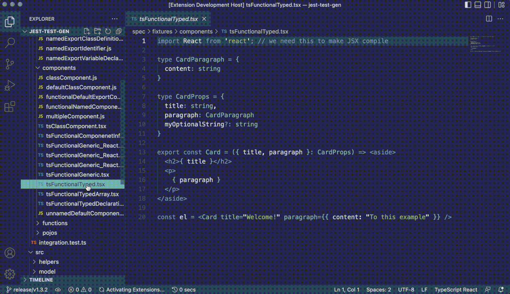
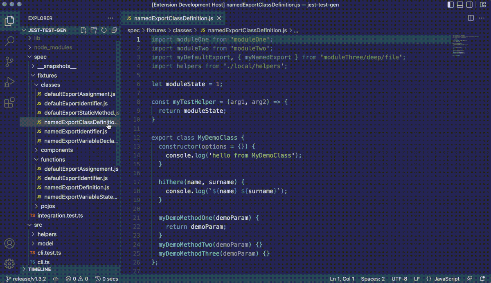

# VS Code jest-test-gen extension

Welcome to VS Code extension for jest-test-gen! 

The fastest way to generate a jest unit test file from a js or ts source.

Simply open a source file and select `Generate Jest tests` from the **command palette** (cmd + shift + P).

## Features

Automates creation of initial unit test files taking dependencies into account.

Parsing and test generation is avaialable for the following exports:

* Typescript typed React class components 🆕
* Typescript typed Functional components 🆕
* React Functional components 🆕
* React Class based components 🆕
* ES6 Classes default export or named exports
* Exported named functions and arrow functions
* Exported POJOs with methods
* Async functions and methods

## Demos

### .ts file with React functional component

### .js file with a es6 class defined plus exported helper function

## Known Issues

Only ES6 exported functions, components, classes and POJOs will be used in the generated test file.

Make sure that what you want to test is exported via `export` or `export default`.

## Release Notes

Users appreciate release notes as you update your extension.

### 1.0.0

Initial extension release 🎉

